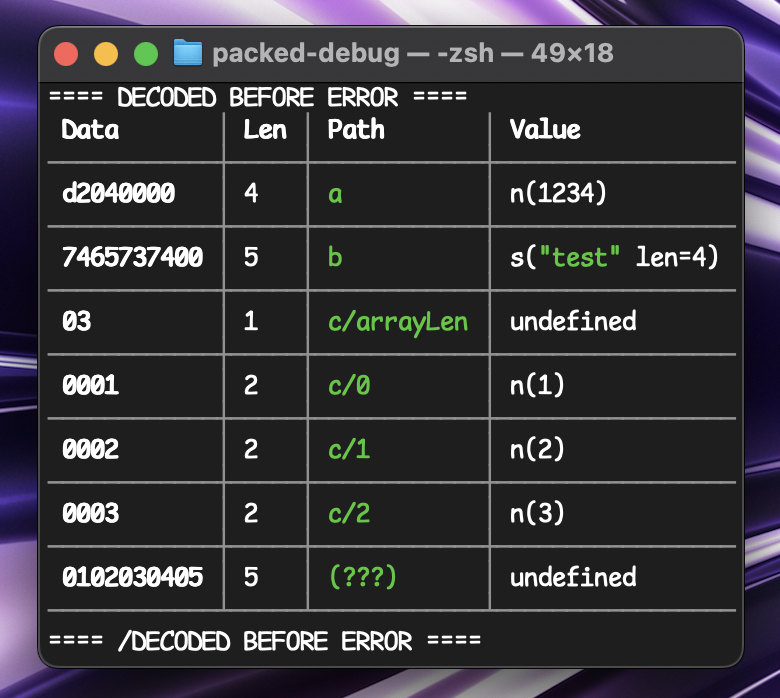
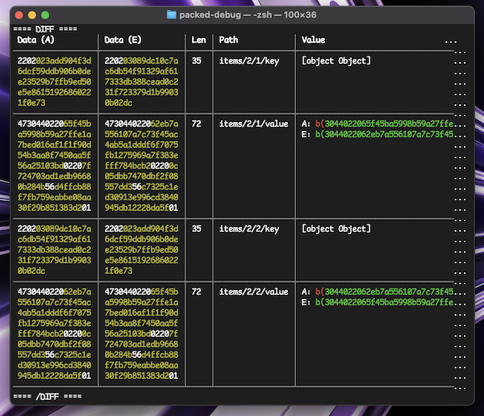

# micro-packed

> Less painful binary encoding / decoding

Define complex binary structures using composable primitives. Comes with a friendly debugger.

Used in:

- [btc-signer](https://github.com/paulmillr/scure-btc-signer) for parsing of Bitcoin Script
- [micro-ordinals](https://github.com/paulmillr/micro-ordinals) for ordinal parsing
- [eth-signer](https://github.com/paulmillr/micro-eth-signer) for RLP and SSZ decoding. RLP pointers are protected against DoS
- [sol-signer](https://github.com/paulmillr/micro-sol-signer) for parsing of keys, messages and other things
- [ed25519-keygen](https://github.com/paulmillr/ed25519-keygen) for lightweight implementations of PGP and SSH
- [micro-otp](https://github.com/paulmillr/micro-signer) just briefly

## Usage

> npm install micro-packed

```ts
import * as P from 'micro-packed';
const s = P.struct({
  field1: P.U32BE, // 32-bit unsigned big-endian integer
  field2: P.string(P.U8), // String with U8 length prefix
  field3: P.bytes(32), // 32 bytes
  field4: P.array(
    P.U16BE,
    P.struct({
      // Array of structs with U16BE length
      subField1: P.U64BE, // 64-bit unsigned big-endian integer
      subField2: P.string(10), // 10-byte string
    })
  ),
});
```

## Debugger

```ts
import * as PD from 'micro-packed/debugger';

PD.decode(<coder>, data);
PD.diff(<coder>, actual, expected);
```





## Utils

- [Array](#array)
- [Bytes](#bytes)
- [String](#string)
- [Tuple](#tuple)
- [Map](#map)
- [Tag](#tag)
- [Magic](#magic)
- [Bits](#bits)
- [Pointer](#pointer)
- [Padding](#padding)
- [Flag](#flag)
- [Flagged](#flagged)
- [Optional](#optional)
- [Lazy](#lazy)
- [Dict](#dict)
- [Validate](#validate)
- [Debug](#debug)
- [Primitive types](#primitive-types)

### Array

Probably most powerful building block

```ts
import * as P from 'micro-packed';
let a1 = P.array(P.U16BE, child); // Dynamic size array (prefixed with P.U16BE number of array length)
let a2 = P.array(4, child); // Fixed size array
let a3 = P.array(null, child); // Unknown size array, will parse until end of buffer
let a4 = P.array(new Uint8Array([0]), child); // zero-terminated array (NOTE: terminator can be any buffer)
```

### Bytes

Same as array of bytes, should be a bit faster than generic implementation, also returns Uint8Array,
instead of array of ints

```ts
import * as P from 'micro-packed';
// same as
let bytes = (len) => P.array(len, P.U8);
const b1 = bytes(P.U16BE);
const b2 = bytes(P.U16BE, true); // bytes in little-endian order
```

### String

Same as bytes, but returns utf8 decoded string

```ts
import * as P from 'micro-packed';
const s = P.string(P.U16BE);
s.decode(new Uint8Array([116, 101, 115, 116])); // -> test
const s2 = P.cstring; // NUL-terminated strings
s.decode(new Uint8Array([116, 101, 115, 116, 0])); // -> test
```

### Tuple

Same as struct, but without fields names

```ts
import * as P from 'micro-packed';

let s = P.tuple([P.U32BE, P.U8, P.bytes(32), ...])
```

### Map

Like enum in C (but without iota).

Allows to map encoded values to string

```ts
import * as P from 'micro-packed';
let s = P.map(P.U8, {
  name1: 1,
  name2: 2,
});
s.decode(new Uint8Array([0x01])); // 'name1'
s.decode(new Uint8Array([0x02])); // 'name2'
s.decode(new Uint8Array([0x00])); // Error!
```

### Tag

Like enum in Rust.

Allows to choice stucture based on some value.
Depending on value of first byte, it will be decoded as array, string or number.

```ts
import * as P from 'micro-packed';

let s = P.tag(P.U8, {
  0x1: P.array(u16, ...),
  0x2: P.string(u16, ...),
  0x3: P.U32BE,
})
```

### Magic

Encodes some constant value into bytes and checks if it is the same on decoding.

```ts
import * as P from 'micro-packed';

let s = P.magic(U8, 123);
s.encode(); // Uint8Array([123])
s.decode(new Uint8Array([123])); // ok
s.decode(new Uint8Array([124])); // error!
```

### Bits

Allows to parse bit-level elements:

```ts
import * as P from 'micro-packed';
// NOTE: structure should parse whole amount of bytes before it can start parsing byte-level elements.
let s = P.struct({ magic: P.bits(1), version: P.bits(1), tag: P.bits(4), len: P.bits(2) });
```

### Pointer

Encodes element as offset into real bytes

```ts
import * as P from 'micro-packed';
const s = P.pointer(P.U8, P.U8);
s.encode(123); // new Uint8Array([1, 123]), first byte is offset position of real value
```

### Padding

Allows to pad value with zero bytes. Optional argument allows to generate padding value based on position.

```ts
import * as P from 'micro-packed';
P.padLeft(3, U8).encode(123); // Uint8Array([0, 0, 123])
P.padRight(3, U8).encode(123); // Uint8Array([123, 0, 0])
```

### Flag

Decodes as true if the value is the same.

```ts
import * as P from 'micro-packed';
const s = P.flag(new Uint8Array([1, 2, 3]));
```

### Flagged

Decodes / encodes struct only when flag/bool value (described as path in structure) is true (conditional encoding).

```ts
import * as P from 'micro-packed';
const s = P.struct({ f: P.flag(new Uint8Array([0x0, 0x1])), f2: P.flagged('f', P.U32BE) });
```

### Optional

Decodes/encodes value only if prefixed flag is true (or encodes default value).

```ts
import * as P from 'micro-packed';
const s = P.optional(P.bool, P.U32BE, 123);
```

### Lazy

Allows definition of circular structures

```ts
import * as P from 'micro-packed';

type Tree = { name: string; children: Tree[] };
const tree = P.struct({
  name: P.cstring,
  children: P.array(
    P.U16BE,
    P.lazy((): P.CoderType<Tree> => tree)
  ),
});
```

### Dict

Converts array (key, value) tuples to dict/object/hashmap:

```ts
import * as P from 'micro-packed';

const dict: P.CoderType<Record<string, number>> = P.apply(
  P.array(P.U16BE, P.tuple([P.cstring, P.U32LE] as const)),
  P.coders.dict()
);
```

### Validate

Validation of value before encoding and after decoding:

```ts
import * as P from 'micro-packed';

const val = (n: number) => {
  if (n > 10) throw new Error(`${n} > 10`);
  return n;
};

const RangedInt = P.validate(P.U32LE, val); // will check in both encoding and decoding
```

### Debug

Easy debug (via console.log), just wrap specific coder for it:

```ts
import * as P from 'micro-packed';
import * as PD from 'micro-packed/debugger';

const debugInt = PD.debug(P.U32LE); // Will print info to console
```

### Primitive types

Available types:

- uint8, int8: unsigned and signed integers
- uint16, uint32, uint64, uint128, uint256 and signed ones
- float32, float64 for IEEE 754-2008 float

```ts
import * as P from 'micro-packed';
// P.U8, P.I8,
// P.U16BE, P.U32BE, P.U64BE, P.U128BE, P.U256BE,
// P.U16LE, P.U32LE, P.U64LE, P.U128LE, P.U256LE,
// P.I16BE, P.I32BE, P.I64BE, P.I128BE, P.I256BE,
// P.I16LE, P.I32LE, P.I64LE, P.I128LE, P.I256LE,
// P.F32BE, P.F64BE, P.F32LE, P.F64LE,
```

## License

MIT (c) Paul Miller [(https://paulmillr.com)](https://paulmillr.com), see LICENSE file.
